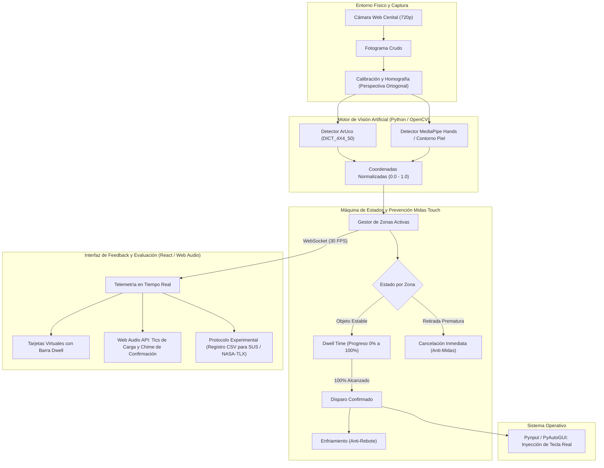

# Interfaz de Escritorio Tangible Accesible (TUI-A)
### Superficie Aumentada de Bajo Costo Mediante Visión Artificial para Usuarios con Reducción Motora Distal

> **Curso:** Interacción Hombre-Máquina (IHM / HCI)  
> **Integrantes:**  
> - Bryan Mango Ticllahuanaco  
> - Anthony Luque Guzmán  

---

## 📖 1. Resumen y Planteamiento del Problema

Los teclados y ratones convencionales fueron concebidos asumiendo una motricidad fina intacta: una tecla estándar mide apenas **$1.5\text{ cm}^2$** y requiere fuerza y puntería milimétrica. Para usuarios con patologías como parálisis, distrofia muscular, artritis, amputaciones o temblores esenciales, el uso del teclado tradicional resulta extenuante, propiciando errores por pulsación de teclas vecinas, imposibilidad de realizar combinaciones de teclas múltiples y fatiga temprana.

**TUI-A** invierte este paradigma: en lugar de forzar al usuario a adaptarse a la rigidez del teclado, el entorno se adapta a las capacidades motoras de la persona. Mediante una cámara web cenital económica (720p) y visión artificial, una mesa de escritorio ordinaria se convierte en una **superficie aumentada interactiva**, donde la activación de teclas se efectúa apoyando la palma/puño completo o deslizando un bloque físico con un marcador fiducial ArUco.

---

## 🧠 2. Fundamentos de Interacción Humano-Computadora (HCI)

1. **Ley de Fitts ($ID = \log_2(2D/W)$):**  
   Al transformar áreas minúsculas en zonas de activación amplias sobre la mesa ($\ge 10\times 10\text{ cm}$), se reduce drásticamente el Índice de Dificultad ($ID$), permitiendo a usuarios con control motor grueso operar el sistema con alta velocidad y mínimo estrés.
2. **Interfaces Tangibles (TUI - Ishii & Ullmer, 1997):**  
   El uso de un bloque físico proporciona *affordance* inmediato y retroalimentación háptica pasiva natural gracias al peso y textura del objeto contra la mesa.
3. **Filtro Anti "Efecto Midas Touch" (Jacob, 1990):**  
   En interfaces continuas por visión, cualquier movimiento inadvertido podría desencadenar una acción. TUI-A resuelve esto exigiendo un tiempo de permanencia (**Dwell Time** de 600 a 1000 ms) antes de validar la pulsación. Si el usuario retira la mano antes de tiempo, la orden se cancela sin consecuencias.
4. **Retroalimentación Multimodal Inmediata (Norman, 2013):**  
   - *Feedforward:* Zonas delimitadas visualmente en pantalla y en la mesa.
   - *Continuous Feedback:* Anillo de carga de Dwell Time y tics auditivos continuos a frecuencia creciente.
   - *Success Confirmation:* Destello visual de alto contraste y sonido armónico (chime) al emitir la tecla al sistema operativo.

---

## 🏗️ 3. Arquitectura del Sistema



---

## 📁 4. Estructura del Repositorio

```text
HombreMaquina/
├── .gitignore                    # Exclusiones de Git (venv, node_modules, logs)
├── README.md                     # Documentación técnica y académica completa
├── generate_markers.py           # Generador de marcadores ArUco imprimibles
├── backend/
│   ├── app.py                    # Servidor FastAPI + WebSockets + Streaming MJPEG
│   ├── calibration.py            # Calibración interactiva de 4 esquinas de la mesa
│   ├── config.json               # Configuración persistente (zonas, cámara, tiempos)
│   ├── keyboard_controller.py    # Emulación de teclado en el SO con Pynput
│   ├── requirements.txt          # Dependencias de Python
│   └── vision/
│       ├── camera.py             # Captura y corrección de perspectiva
│       ├── aruco_detector.py     # Reconocimiento de bloques con ArUco
│       ├── hand_detector.py      # Detección de palma/puño (MediaPipe + fallback)
│       └── zone_manager.py       # Máquina de estados y control de Dwell Time
└── frontend/
    ├── package.json              # Dependencias de Node.js / React
    ├── vite.config.js            # Configuración de empaquetado Vite
    ├── tailwind.config.js        # Estilos y accesibilidad Tailwind
    ├── index.html
    └── src/
        ├── App.jsx               # Tablero interactivo principal
        ├── main.jsx              # Punto de entrada de React
        ├── index.css             # Animaciones de feedback visual
        ├── components/
        │   ├── ZoneCard.jsx      # Visualización de tecla con progreso circular
        │   ├── SettingsModal.jsx # Ajustes de Dwell Time y cooldown en caliente
        │   └── UsabilityTest.jsx # Batería de pruebas y exportación a CSV
        └── hooks/
            ├── useWebSocket.js   # Canal de telemetría a 30 FPS
            └── useSoundEffects.js# Generación de tonos con Web Audio API
```

---

## 🚀 5. Guía de Instalación y Puesta en Marcha

### Requisitos Previos
- **Python 3.10+** instalado y en el PATH del sistema.
- **Node.js v18+ y npm** instalados.
- Cámara web USB conectada con vista cenital sobre la mesa.

### Paso 1: Configurar el Backend (Python)
Abre una terminal en la raíz del proyecto:
```bash
# 1. Crear entorno virtual de Python
python -m venv venv

# 2. Activar entorno virtual
# En Windows (PowerShell):
.\venv\Scripts\Activate.ps1
# En Windows (CMD):
.\venv\Scripts\activate.bat

# 3. Instalar librerías requeridas
pip install -r backend/requirements.txt
```

### Paso 2: Generar e Imprimir los Marcadores ArUco
Ejecuta el script generador:
```bash
python generate_markers.py
```
Los archivos PNG de alta resolución se crearán en la carpeta `markers/`. Imprímelos y pégalos en la cara superior de bloques o cubos planos de aproximadamente $5\times 5\text{ cm}$.

### Paso 3: Calibrar la Perspectiva de la Mesa
Coloca tu cámara apuntando hacia la mesa y ejecuta:
```bash
python backend/calibration.py
```
1. Haz un clic izquierdo en cada una de las 4 esquinas de tu área de trabajo (Superior-Izq, Superior-Der, Inferior-Der, Inferior-Izq).
2. Presiona la tecla **S** para guardar la calibración en `config.json`.
3. Presiona **Q** para salir.

### Paso 4: Iniciar el Servidor Backend
```bash
python backend/app.py
```
El servidor arrancará en `http://localhost:8000` con el WebSocket activo en `ws://localhost:8000/ws` y la transmisión en video en `http://localhost:8000/video_feed`.

### Paso 5: Configurar e Iniciar el Frontend (React)
Abre una segunda terminal en la carpeta `frontend/`:
```bash
cd frontend
npm install
npm run dev
```
Abre tu navegador en `http://localhost:5173`. Verás la interfaz de usuario en tiempo real con las tarjetas interactivas y la vista cenital.

---

## 📊 6. Protocolo de Evaluación de Usabilidad (HCI)

El sistema integra un módulo de laboratorio accesible desde la pestaña **"Protocolo de Usabilidad"**:

1. **Procedimiento Experimental:**
   - Asigna un código al participante (ej. `Sujeto_01`).
   - Selecciona la modalidad a evaluar: **Mano / Puño** o **Bloque Tangible ArUco**.
   - Haz clic en **Iniciar Test**. La pantalla solicitará activar teclas de forma secuencial y aleatoria (ej. "Activa: ESPACIO").
   - El sistema registra automáticamente:
     - Tiempo de Reacción y Movimiento en milisegundos.
     - Errores de activación (efecto Midas Touch o pulsaciones en zonas equivocadas).
     - Tasa de éxito porcentual.
2. **Exportación de Datos:**
   - Al finalizar, haz clic en **Exportar CSV** para descargar la planilla `tui_a_metricas_Sujeto_01.csv`.
3. **Cuestionarios Estandarizados Complementarios:**
   - **SUS (System Usability Scale):** Cuestionario de 10 preguntas con escala Likert (1 a 5) para cuantificar la usabilidad percibida (meta $\ge 68$ puntos).
   - **NASA-TLX:** Evaluación del esfuerzo cognitivo, físico, temporal, frustración y rendimiento.

---

## 📚 7. Referencias Bibliográficas (Formato APA)

- Brooke, J. (1996). SUS: A "quick and dirty" usability scale. En P. W. Jordan, B. Thomas, B. A. Weerdmeester, & A. L. McClelland (Eds.), *Usability evaluation in industry* (pp. 189–194). Taylor & Francis.
- Garrido-Jurado, S., Muñoz-Salinas, R., Madrid-Cuevas, F. J., & Marín-Jiménez, M. J. (2014). Automatic generation and detection of highly reliable fiducial markers under severe video conditions. *Pattern Recognition*, 47(6), 2280–2292.
- Hart, S. G., & Staveland, L. E. (1988). Development of NASA-TLX (Task Load Index): Results of empirical and theoretical research. En P. A. Hancock & N. Meshkati (Eds.), *Human mental workload* (pp. 139–183). North-Holland.
- Ishii, H., & Ullmer, B. (1997). Tangible bits: Towards seamless interfaces between people, bits and atoms. En *Proceedings of the ACM SIGCHI Conference on Human Factors in Computing Systems (CHI '97)* (pp. 234–241). ACM.
- Jacob, R. J. K. (1990). What you look at is what you get: Eye movement-based interaction techniques. En *Proceedings of the SIGCHI Conference on Human Factors in Computing Systems (CHI '90)* (pp. 11–18). ACM.
- Norman, D. A. (2013). *The design of everyday things* (Rev. ed.). Basic Books.
- Wellner, P. (1993). Interacting with paper on the DigitalDesk. *Communications of the ACM*, 36(7), 87–96.
